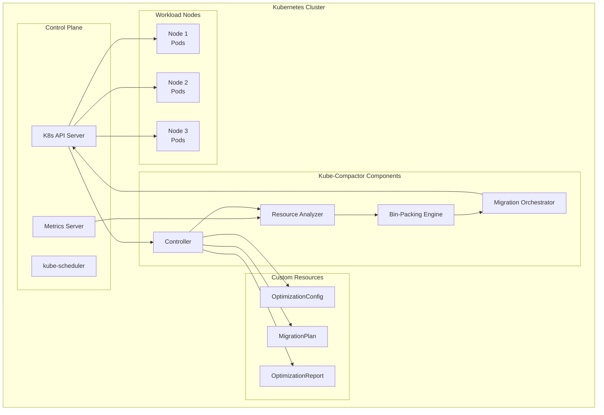
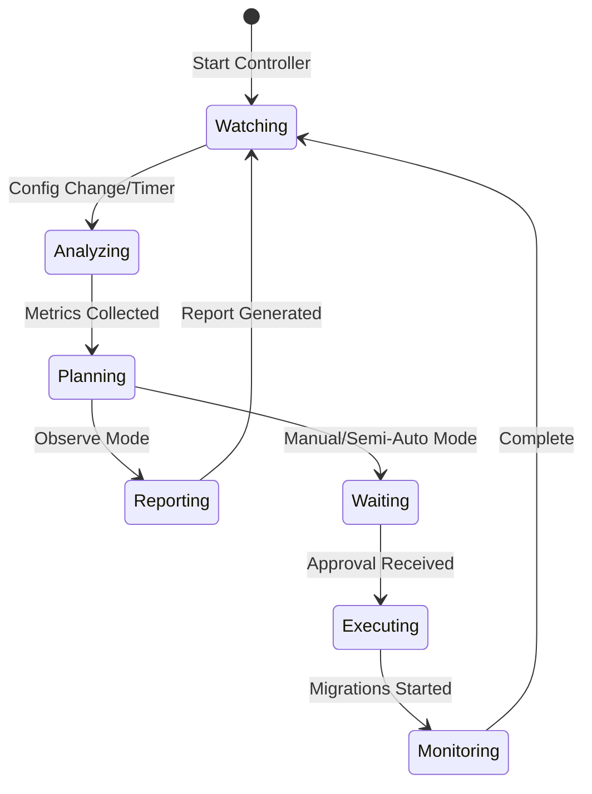
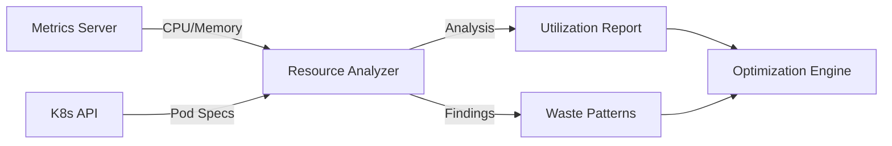
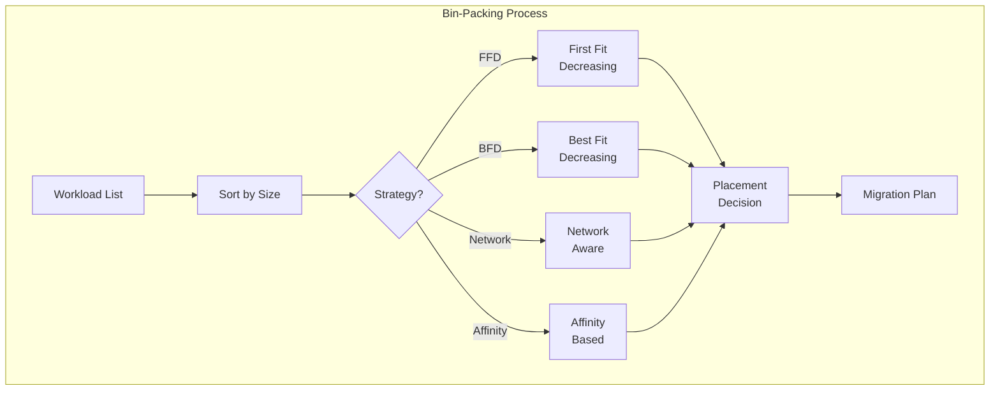
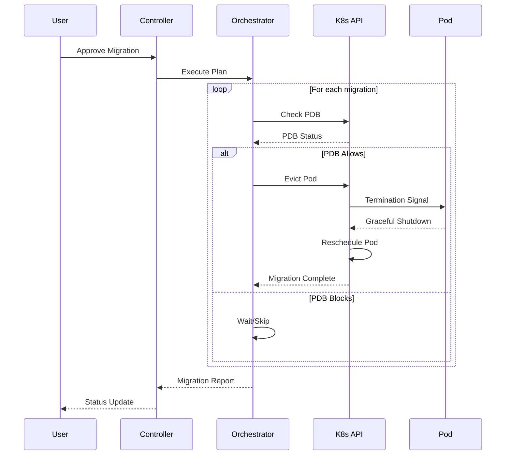
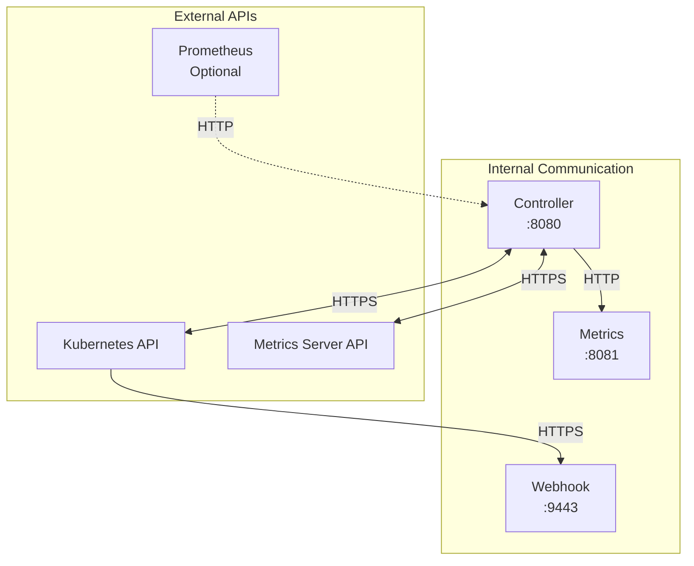
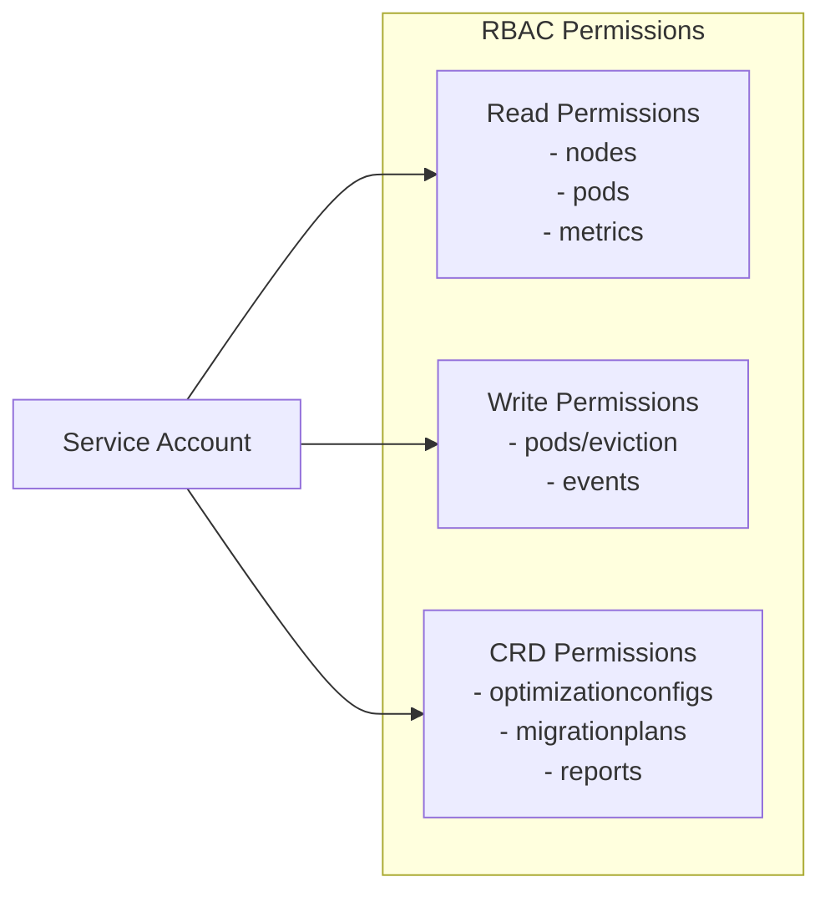
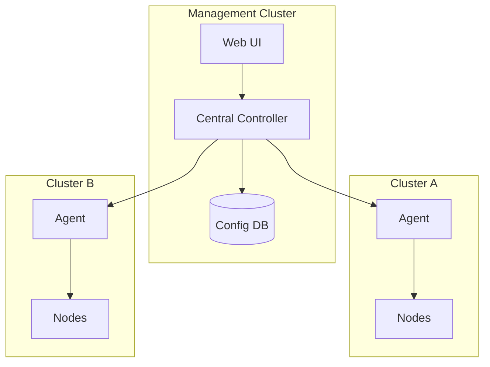
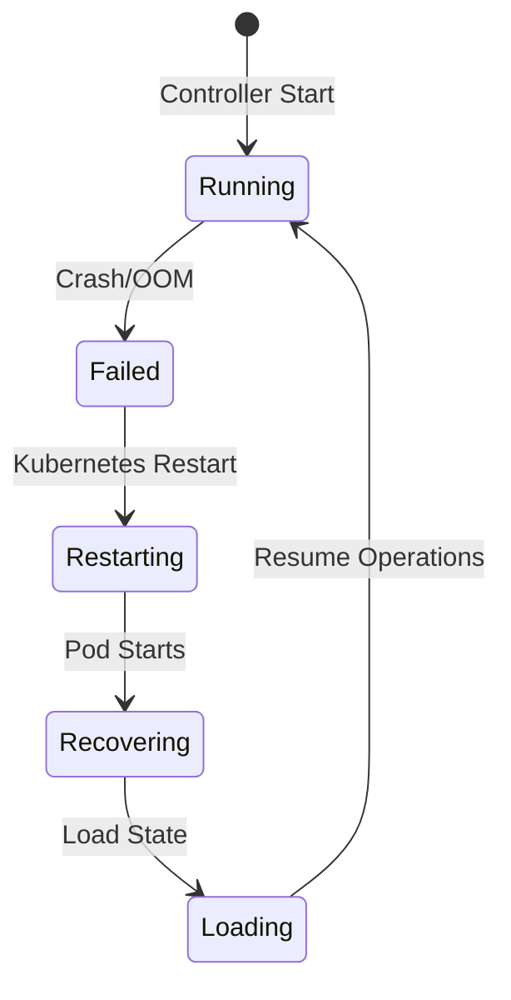

# System Architecture

## High-Level Architecture

Kube-Compactor is designed as a Kubernetes-native application using the operator pattern:



## Component Architecture

### 1. Controller (Brain)

The controller is the central component that orchestrates all operations:



**Responsibilities:**
- Watch Custom Resources (CRDs)
- Trigger analysis based on schedule
- Manage operation modes
- Coordinate other components
- Handle migration approvals

**Key Files:**
- `k8s-controller/src/controller.js`
- Implements reconciliation loop
- Manages CRD lifecycle

### 2. Resource Analyzer

Collects and analyzes cluster resource usage:

```javascript
class ResourceAnalyzer {
    analyzeUtilization() {
        // Collect node metrics
        // Calculate utilization percentages
        // Identify waste patterns
        // Generate efficiency scores
    }

    identifyOverprovisionedWorkloads() {
        // Compare limits vs usage
        // Flag workloads using <30% of allocated resources
        // Calculate right-sizing recommendations
    }
}
```

**Data Flow:**



### 3. Bin-Packing Engine

The core optimization algorithm:



**Algorithm Implementation:**

```javascript
optimizePlacement(workloads, nodes, strategy) {
    // 1. Sort workloads by resource requirements
    const sorted = this.sortWorkloads(workloads, strategy);

    // 2. Initialize placement map
    const placement = new Map();

    // 3. For each workload, find best node
    for (const workload of sorted) {
        const targetNode = this.findBestNode(workload, nodes, strategy);
        if (targetNode) {
            this.placeWorkload(workload, targetNode, placement);
        }
    }

    // 4. Generate migration plan
    return this.generateMigrationPlan(placement);
}
```

### 4. Migration Orchestrator

Handles safe workload migration:



## Data Models

### Custom Resource Definitions (CRDs)

#### OptimizationConfig
```yaml
apiVersion: optimizer.io/v1alpha1
kind: OptimizationConfig
metadata:
  name: default
spec:
  mode: observe|manual|semi-auto|full-auto
  schedule: "*/30 * * * *"
  safetyThreshold: conservative|medium|aggressive
  targetNamespaces: []
  excludeNamespaces: []
  binPackingStrategy: first-fit|best-fit|network-aware
  safeWindows:
    - start: "02:00"
      end: "05:00"
      days: ["Mon", "Tue", "Wed", "Thu", "Fri"]
status:
  phase: Pending|Analyzing|Ready|Error
  lastAnalysis: "2024-01-20T10:00:00Z"
  nodeCount: 5
  workloadCount: 23
  potentialSavings: "$1,200/month"
```

#### MigrationPlan
```yaml
apiVersion: optimizer.io/v1alpha1
kind: MigrationPlan
metadata:
  name: migplan-1234567890
spec:
  migrations:
    - workload:
        name: frontend-deployment
        namespace: default
        kind: Deployment
      fromNode: node-1
      toNode: node-2
      risk: low|medium|high
      reason: "Consolidation for cost savings"
  approved: false
  approvedBy: ""
status:
  phase: Pending|Approved|Executing|Completed|Failed
  executedMigrations: 0
  totalMigrations: 12
```

## Network Architecture

### Service Communication



### Security Model



## Deployment Architecture

### Single Cluster Deployment

```yaml
namespace: kube-compactor
├── Deployment: controller (1 replica)
├── ServiceAccount: kube-compactor
├── ClusterRole: kube-compactor
├── ClusterRoleBinding: kube-compactor
├── Service: metrics
└── ConfigMap: configuration
```

### Multi-Cluster Architecture (Future)



## Algorithm Deep Dive

### First Fit Decreasing (FFD)

```python
def first_fit_decreasing(workloads, nodes):
    # Sort workloads by size (largest first)
    workloads.sort(key=lambda w: w.cpu + w.memory, reverse=True)

    for workload in workloads:
        for node in nodes:
            if node.can_fit(workload):
                node.place(workload)
                break

    return nodes
```

**Time Complexity:** O(n log n) for sorting + O(nm) for placement
**Space Complexity:** O(1) extra space

### Network-Aware Packing

```python
def network_aware_packing(workloads, nodes, traffic_matrix):
    # Build communication graph
    graph = build_communication_graph(workloads, traffic_matrix)

    # Find strongly connected components
    components = find_components(graph)

    # Pack components together
    for component in components:
        target_node = find_best_node_for_component(component, nodes)
        for workload in component:
            target_node.place(workload)

    return nodes
```

## Performance Characteristics

### Scalability

| Cluster Size | Analysis Time | Memory Usage |
|-------------|---------------|--------------|
| 10 nodes | <1 second | 50 MB |
| 100 nodes | 2-3 seconds | 200 MB |
| 1000 nodes | 15-20 seconds | 1 GB |
| 10000 nodes | 2-3 minutes | 8 GB |

### Resource Requirements

**Controller Pod:**
- CPU Request: 100m
- CPU Limit: 500m
- Memory Request: 128Mi
- Memory Limit: 512Mi

**Supports Clusters With:**
- Up to 10,000 nodes
- Up to 100,000 pods
- Analysis cycle: 30 seconds minimum

## Failure Handling

### Controller Failure



### Migration Failure

1. **Pre-flight Checks**: Verify capacity before migration
2. **Graceful Degradation**: Skip failed migrations
3. **Rollback**: Automatic rollback on critical failures
4. **Alerting**: Generate events for failures

## Monitoring & Observability

### Metrics Exposed

```prometheus
# Controller metrics
kube_compactor_analysis_duration_seconds
kube_compactor_migrations_total{status="success|failed"}
kube_compactor_nodes_total
kube_compactor_workloads_total
kube_compactor_potential_savings_dollars

# Algorithm metrics
kube_compactor_binpacking_duration_seconds
kube_compactor_binpacking_efficiency_percent
kube_compactor_placement_score
```

### Logging Levels

```javascript
LOG_LEVELS = {
    ERROR: 0,   // Critical errors only
    WARN: 1,    // Warnings and errors
    INFO: 2,    // General information
    DEBUG: 3,   // Detailed debugging
    TRACE: 4    // Full trace logging
}
```

---

## Key Architectural Decisions

1. **Operator Pattern**: Native Kubernetes integration
2. **CRD-Based Configuration**: GitOps friendly
3. **Stateless Design**: No persistent storage required
4. **Pull-Based Metrics**: Uses standard Metrics Server
5. **Pluggable Algorithms**: Easy to add new strategies
6. **Safety First**: Multiple approval mechanisms

## Next Topics

- [Algorithm Details](algorithms)
- [Custom Resources](crds)
- [Security Model](security)