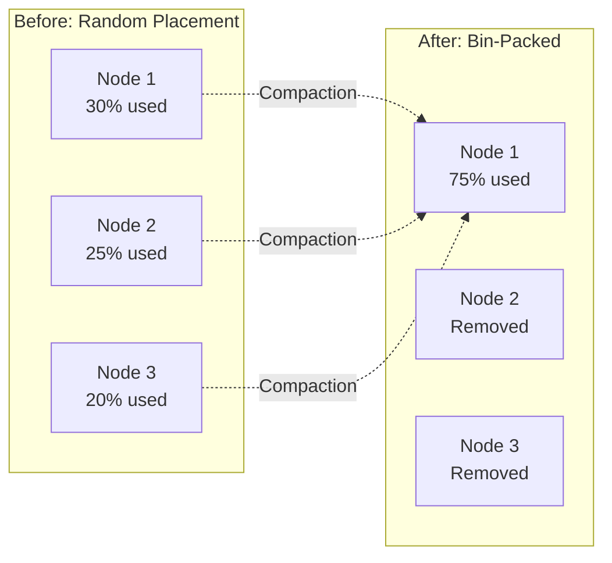
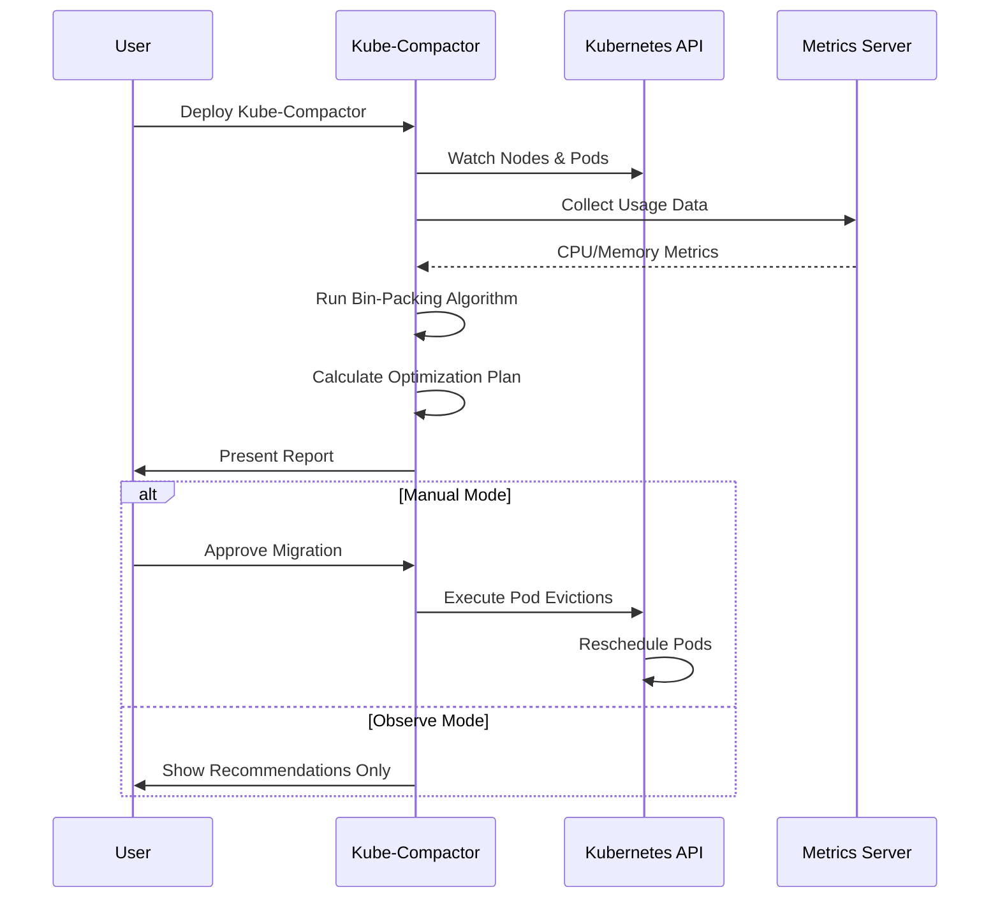

# Introduction to Kube-Compactor

## What Problem Does Kube-Compactor Solve?

Most Kubernetes clusters run at **15-30% utilization** while paying for 100% of the resources. This happens because:

1. **Resource Requests vs Reality**: Developers request more resources than needed (safety margin)
2. **Poor Workload Distribution**: Kubernetes default scheduler doesn't optimize for density
3. **Peak vs Average**: Resources sized for peak load but mostly run at average
4. **Fragmentation**: Small workloads spread across many nodes

### The Cost Impact

```
Typical 10-node cluster:
- Monthly cost: $5,000
- Actual utilization: 30%
- Wasted spend: $3,500/month
- Annual waste: $42,000
```

## How Kube-Compactor Works

Kube-Compactor uses **bin-packing algorithms** to consolidate workloads intelligently:

### Before Kube-Compactor
```
Node-1: [App1: 20%][Empty: 80%        ]
Node-2: [App2: 15%][Empty: 85%        ]
Node-3: [App3: 25%][Empty: 75%        ]
Node-4: [App4: 10%][Empty: 90%        ]
Cost: $2000/month
```

### After Kube-Compactor
```
Node-1: [App1: 20%][App2: 15%][App3: 25%][App4: 10%][Buffer: 30%]
Node-2: [REMOVED - Saved $500/month]
Node-3: [REMOVED - Saved $500/month]
Node-4: [REMOVED - Saved $500/month]
Cost: $500/month (75% savings!)
```

## Core Technology: Bin-Packing Algorithms

### What is Bin-Packing?

Imagine you have boxes (workloads) of different sizes and containers (nodes) with fixed capacity. The goal is to fit all boxes using the minimum number of containers.



### Algorithm Types

1. **First Fit Decreasing (FFD)**
   - Sorts workloads by size (largest first)
   - Places each in the first node with space
   - Best for: General use

2. **Best Fit Decreasing (BFD)**
   - Finds the node with least remaining space
   - Minimizes wasted space
   - Best for: Memory-constrained environments

3. **Network-Aware Packing**
   - Groups communicating services together
   - Reduces cross-node network traffic
   - Best for: Microservices architectures

4. **Affinity-Based Packing**
   - Respects workload affinity rules
   - Maintains high availability requirements
   - Best for: Production environments

## Key Differentiators

### vs Vertical Pod Autoscaler (VPA)
| Feature | VPA | Kube-Compactor |
|---------|-----|----------------|
| Adjusts pod resources | ✅ | ✅ |
| Moves workloads | ❌ | ✅ |
| Bin-packing optimization | ❌ | ✅ |
| Network-aware placement | ❌ | ✅ |
| Node consolidation | ❌ | ✅ |

### vs Cluster Autoscaler
| Feature | Cluster Autoscaler | Kube-Compactor |
|---------|-------------------|----------------|
| Adds nodes | ✅ | ❌ |
| Removes empty nodes | ✅ | ❌ |
| Optimizes placement | ❌ | ✅ |
| Consolidates workloads | ❌ | ✅ |
| Reduces fragmentation | ❌ | ✅ |

## Understanding the Flow



## Real-World Example

Let's say you have a cluster with 5 nodes running microservices:

### Current State Analysis
```yaml
Node-1 (m5.xlarge):
  - frontend-pod: 0.5 CPU, 1GB RAM (actual usage)
  - Total usage: 12.5% CPU, 25% Memory

Node-2 (m5.xlarge):
  - backend-pod: 0.8 CPU, 2GB RAM
  - Total usage: 20% CPU, 50% Memory

Node-3 (m5.xlarge):
  - database-pod: 1.0 CPU, 3GB RAM
  - Total usage: 25% CPU, 75% Memory

Node-4 (m5.xlarge):
  - cache-pod: 0.3 CPU, 1GB RAM
  - Total usage: 7.5% CPU, 25% Memory

Node-5 (m5.xlarge):
  - worker-pod: 0.4 CPU, 1GB RAM
  - Total usage: 10% CPU, 25% Memory

Monthly Cost: 5 × $140 = $700
```

### After Kube-Compactor Optimization
```yaml
Node-1 (m5.xlarge):
  - frontend-pod: 0.5 CPU, 1GB RAM
  - backend-pod: 0.8 CPU, 2GB RAM
  - cache-pod: 0.3 CPU, 1GB RAM
  - worker-pod: 0.4 CPU, 1GB RAM
  - Total usage: 50% CPU, 125% Memory

Node-3 (m5.xlarge):
  - database-pod: 1.0 CPU, 3GB RAM
  - Total usage: 25% CPU, 75% Memory

Nodes 2, 4, 5: REMOVED

Monthly Cost: 2 × $140 = $280
Savings: $420/month (60% reduction)
```

## Safety Mechanisms

Kube-Compactor includes multiple safety features:

1. **Pod Disruption Budgets**: Respects PDBs during migration
2. **Gradual Migration**: Moves one workload at a time
3. **Health Checks**: Verifies pod health after migration
4. **Rollback**: One-command rollback if issues arise
5. **Safe Windows**: Executes during low-traffic periods

## Who Should Use Kube-Compactor?

### Perfect For:
- **FinOps Teams**: Reducing cloud costs
- **Platform Engineers**: Optimizing cluster efficiency
- **SRE Teams**: Improving resource utilization
- **DevOps Engineers**: Automating optimization

### Use Cases:
- Development/Staging clusters with variable load
- Production clusters with predictable workloads
- Multi-tenant environments with resource quotas
- Cost optimization initiatives

## Next Steps

Ready to start optimizing your cluster?

<div class="button-group">
  <a href="quick-start" class="btn btn-primary">Quick Start Guide →</a>
  <a href="installation" class="btn btn-outline">Detailed Installation →</a>
</div>

---

### Key Takeaways

- 📊 Most clusters waste 70% of resources due to poor workload distribution
- 🗜️ Bin-packing algorithms can consolidate workloads efficiently
- 💰 Typical savings range from 30-70% of infrastructure costs
- 🔒 Multiple safety mechanisms ensure production readiness
- 🎮 Full control over optimization actions with multiple operation modes