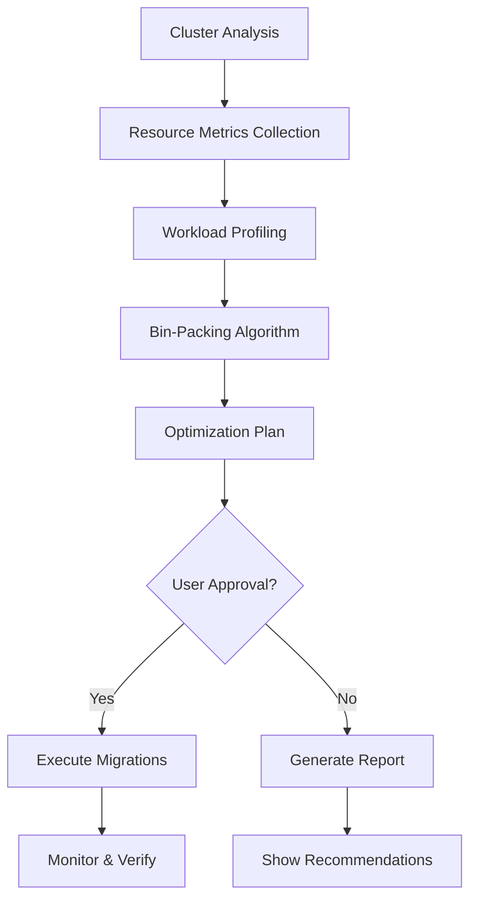

# 🗜️ Kube-Compactor Documentation

<div align="center">
  

  **Reduce Kubernetes costs by 30-70% through intelligent workload consolidation**

  [](https://github.com/KanurkarPrateek/Kube-Compacter)
  [](https://hub.docker.com/r/kanurkarprateek/kube-compactor)
  [](LICENSE)
</div>

## 📚 Documentation Overview

Welcome to the Kube-Compactor documentation! This guide covers everything from basic installation to advanced optimization strategies.

### 🎯 Quick Navigation

<div class="grid-container">
  <div class="grid-item">
    <h3>🚀 Getting Started</h3>
    <ul>
      <li><a href="getting-started/introduction">What is Kube-Compactor?</a></li>
      <li><a href="getting-started/quick-start">5-Minute Quick Start</a></li>
      <li><a href="getting-started/installation">Installation Guide</a></li>
      <li><a href="getting-started/first-analysis">Your First Analysis</a></li>
    </ul>
  </div>

  <div class="grid-item">
    <h3>📖 Core Concepts</h3>
    <ul>
      <li><a href="concepts/bin-packing">Bin-Packing Algorithms</a></li>
      <li><a href="concepts/operation-modes">Operation Modes</a></li>
      <li><a href="concepts/safety-features">Safety Features</a></li>
      <li><a href="concepts/migration-strategies">Migration Strategies</a></li>
    </ul>
  </div>

  <div class="grid-item">
    <h3>🏗️ Architecture</h3>
    <ul>
      <li><a href="architecture/overview">System Architecture</a></li>
      <li><a href="architecture/controller">Controller Design</a></li>
      <li><a href="architecture/algorithms">Algorithm Deep Dive</a></li>
      <li><a href="architecture/crds">Custom Resources</a></li>
    </ul>
  </div>

  <div class="grid-item">
    <h3>⚙️ Configuration</h3>
    <ul>
      <li><a href="configuration/basic">Basic Configuration</a></li>
      <li><a href="configuration/advanced">Advanced Settings</a></li>
      <li><a href="configuration/helm-values">Helm Values</a></li>
      <li><a href="configuration/examples">Configuration Examples</a></li>
    </ul>
  </div>
</div>

## 🎓 Learning Paths

Choose your learning path based on your experience level:

### 👶 Beginner Path
Start here if you're new to Kubernetes optimization:
1. [Introduction to Cluster Optimization](getting-started/introduction)
2. [Understanding Resource Waste](concepts/resource-waste)
3. [Quick Start Guide](getting-started/quick-start)
4. [Basic Configuration](configuration/basic)

### 🧑‍💻 Practitioner Path
For experienced Kubernetes users:
1. [Architecture Overview](architecture/overview)
2. [Bin-Packing Algorithms](concepts/bin-packing)
3. [Advanced Configuration](configuration/advanced)
4. [Production Deployment](deployment/production)

### 🚀 Expert Path
For platform engineers and SREs:
1. [Algorithm Customization](advanced/custom-algorithms)
2. [Multi-Cluster Setup](advanced/multi-cluster)
3. [Custom Controllers](advanced/extending)
4. [Performance Tuning](advanced/performance)

## 📊 How Kube-Compactor Works



## 🌟 Key Features

<div class="features-grid">
  <div class="feature">
    <h3>🧮 Advanced Algorithms</h3>
    <p>Multiple bin-packing strategies including FFD, BFD, and network-aware placement</p>
  </div>

  <div class="feature">
    <h3>🔒 Safety First</h3>
    <p>Multiple operation modes from observe-only to semi-automated with full control</p>
  </div>

  <div class="feature">
    <h3>📈 Real-time Analysis</h3>
    <p>Continuous monitoring and optimization recommendations</p>
  </div>

  <div class="feature">
    <h3>💰 Cost Optimization</h3>
    <p>Typically achieves 30-70% reduction in infrastructure costs</p>
  </div>
</div>

## 🚦 Operation Modes

Kube-Compactor offers four operation modes to match your comfort level:

| Mode | Description | Risk Level | Use Case |
|------|-------------|------------|----------|
| **Observe** | Analysis only, no actions | None | Initial evaluation |
| **Manual** | Requires approval for each action | Low | Production environments |
| **Semi-Auto** | Auto-executes safe operations | Medium | Staging/Dev environments |
| **Full-Auto** | Fully automated (not recommended) | High | Testing only |

## 📈 Real-World Results

<div class="stats-container">
  <div class="stat">
    <h2>66%</h2>
    <p>Average node reduction</p>
  </div>
  <div class="stat">
    <h2>$28K</h2>
    <p>Monthly savings (Enterprise)</p>
  </div>
  <div class="stat">
    <h2>15min</h2>
    <p>Time to first optimization</p>
  </div>
</div>

## 🛠️ Installation Options

### Quick Install (Observe Mode - Safe)
```bash
kubectl apply -f https://raw.githubusercontent.com/KanurkarPrateek/Kube-Compacter/main/k8s-controller/deploy/quick-start.yaml
```

### Helm Installation (Recommended)
```bash
helm repo add kube-compactor https://kanurkarprateek.github.io/Kube-Compacter
helm install kube-compactor kube-compactor/kube-compactor
```

### Docker CLI
```bash
docker run -v ~/.kube/config:/home/nodejs/.kube/config:ro \
  kanurkarprateek/kube-compactor:latest analyze --cluster
```

## 📖 In-Depth Guides

### For DevOps Engineers
- [Deployment Strategies](guides/deployment-strategies)
- [CI/CD Integration](guides/cicd-integration)
- [Monitoring & Alerts](guides/monitoring)

### For Platform Teams
- [Multi-Tenant Configuration](guides/multi-tenant)
- [RBAC Setup](guides/rbac)
- [Audit & Compliance](guides/audit)

### For FinOps Teams
- [Cost Analysis](guides/cost-analysis)
- [Savings Reports](guides/savings-reports)
- [Chargeback Integration](guides/chargeback)

## 🤝 Community & Support

- **GitHub**: [Report Issues](https://github.com/KanurkarPrateek/Kube-Compacter/issues)
- **Discussions**: [Community Forum](https://github.com/KanurkarPrateek/Kube-Compacter/discussions)
- **Slack**: [Join #kube-compactor](https://kubernetes.slack.com)

## 📝 Latest Updates

- **v1.0.0** - Initial release with core bin-packing algorithms
- **Coming Soon** - Web UI Dashboard
- **Roadmap** - Multi-cluster support, ML-based predictions

---

<div align="center">
  <p><strong>Ready to reduce your Kubernetes costs?</strong></p>
  <a href="getting-started/quick-start" class="btn btn-primary">Get Started →</a>
</div>